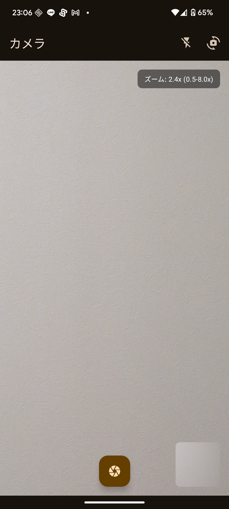
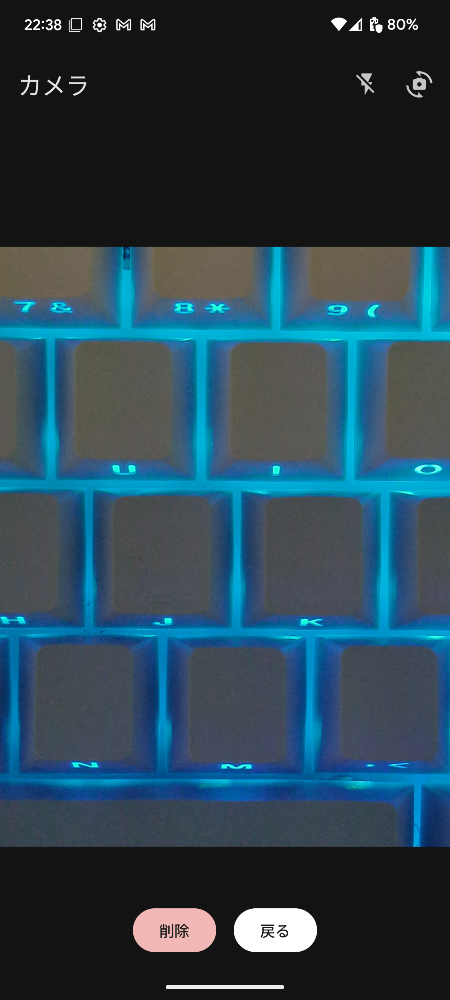
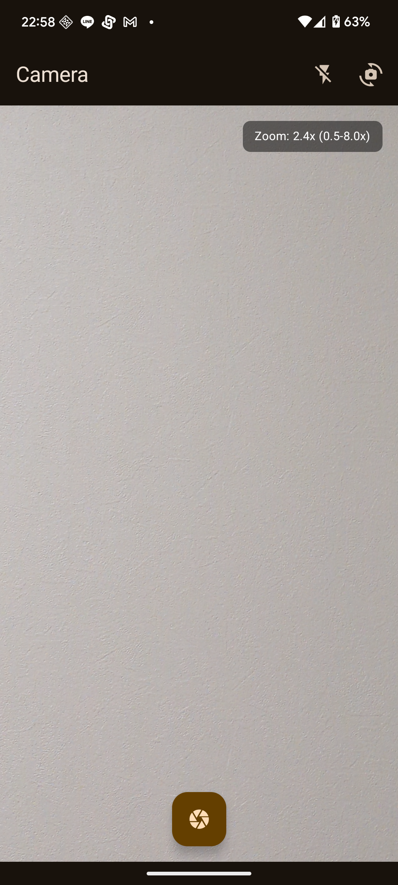
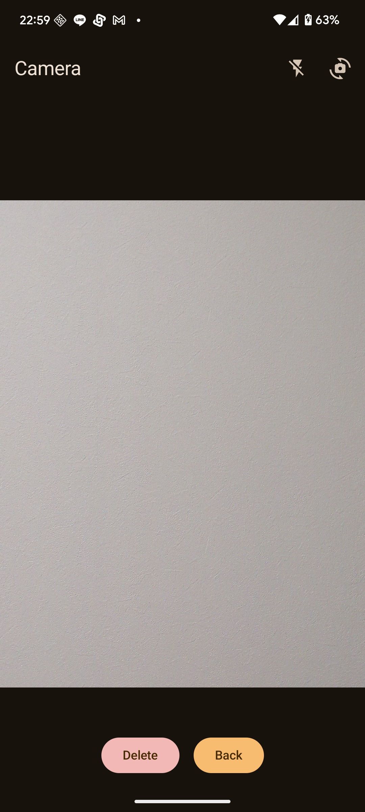

# VTuber Camera

**Read this in other languages**: [English](README.md) | [日本語](README.ja.md)

<div align="center">

**Modern Camera Application Built with Jetpack Compose**

[](https://android.com)
[](https://kotlinlang.org)
[](https://developer.android.com/jetpack/compose)
[](https://developer.android.com/camerax)
[](https://m3.material.io)

</div>

## 📝 Specification (Current Implementation)

### Overview
Jetpack Compose-based Android camera app providing real-time preview and photo capture, with Android 15 features and internationalization.

### Architecture
- **MainActivity** – Initializes Android 15 capabilities and displays `CameraScreen`.
- **CameraScreen** – Compose UI handling permission checks, preview, capture, and photo review.
- **CameraViewModel** – Manages camera state via `StateFlow`, including zoom, flash, and capture logic.
- **Utilities / Components**
  - Permission management (`PermissionUtils`)
  - Android 15 feature utilities (`Android15Features`)
  - Image display (`AsyncImage`)
- **Theme** – Material Design 3 with dynamic color and dark mode.

## 📸 Screenshots

<div align="center">

### Japanese UI
| Camera Preview | Photo Preview |
|:---:|:---:|
|  |  |
| Real-time camera preview display | Photo confirmation and delete function |

### English UI
| Camera Preview | Photo Preview |
|:---:|:---:|
|  |  |
| Real-time camera preview display | Photo confirmation and delete function |

</div>

## ✨ Key Features

### 📱 Camera Features
- 🎥 **Real-time Preview** - High-quality camera preview with CameraX 1.4.2
- 📷 **High-quality Capture** - JPEG photo capture and auto-save (Pictures/VTuberCamera folder)
- 🔄 **Camera Switching** - Seamless front/back camera switching
- ⚡ **Flash Control** - 3 modes support: ON/OFF/AUTO
- 🔍 **Zoom Function** - Pinch gesture and button zoom controls
- 🖼️ **Preview Mode** - Instant photo confirmation and delete function
- 📐 **Rotation Support** - Automatic adjustment for device rotation

### 🎨 UI/UX
- 🌟 **Material Design 3** - Latest design system implementation
- 🌙 **Dark Mode Support** - System setting integration
- 🎨 **Dynamic Color** - Android 12+ dynamic theme support
- 📱 **Declarative UI** - Intuitive interface with Jetpack Compose
- ⚡ **Fast Response** - Startup time < 2s, capture response < 200ms

## 🏗️ Tech Stack

### Core Technologies
- **Language**: Kotlin 1.9.25
- **UI Framework**: Jetpack Compose 1.7.8
- **Camera**: CameraX 1.4.2
- **Architecture**: MVVM + StateFlow
- **Design**: Material Design 3
- **Image Processing**: Coil 2.7.0
- **Dependency Management**: Dependabot Automation

### Development Environment
- **Android Studio**: Koala or above (Kotlin 1.9.25 support required)
- **Gradle**: 8.12+ (Android Gradle Plugin 8.12.1)
- **Min SDK**: 25 (Android 7.1+)
- **Target SDK**: 36 (Android 16)
- **Compile SDK**: 36 (Android 16 support)
- **JDK**: 11+ (Kotlin 1.9.25 recommended)

## 🚀 How to Use

### Basic Operations
1. **Launch App** - Tap the camera icon to start the application
2. **Grant Permission** - Approve camera usage permission
3. **Take Photo** - Use the center capture button to take photos
4. **Preview** - Tap the thumbnail in the bottom right to view captured photos

### Advanced Features
- **Camera Switching**: Tap the switch icon in the top right
- **Flash Control**: Tap the flash icon in the top right to change settings (OFF→ON→AUTO→OFF)
- **Zoom Operations**: 
  - Pinch in/out gesture
  - +/- buttons in the bottom left
- **Photo Management**: Delete or save options in preview mode

## 📁 Project Structure

```
📦 VtuberCamera
├── 📱 app/src/main/
│   ├── 🏠 MainActivity.kt                       # Main entry point
│   ├── 📄 AndroidManifest.xml                   # App manifest and permissions
│   │
│   ├── 🎯 java/com/example/vtubercamera/
│   │   ├── 🎥 ui/screens/CameraScreen.kt        # Camera screen implementation (Compose)
│   │   ├── 🏗️ ui/viewmodels/CameraViewModel.kt  # State management (MVVM)
│   │   ├── 🎨 ui/components/AsyncImage.kt       # Image display component
│   │   ├── 🎨 ui/theme/                         # Material Design 3 theme
│   │   │   ├── Theme.kt                        # App theme definition
│   │   │   ├── Color.kt                        # Color palette
│   │   │   └── Type.kt                         # Typography
│   │   └── 🔧 utils/                           # Utility classes
│   │       ├── Android15Features.kt           # Android 15 feature support
│   │       └── PermissionUtils.kt              # Permission management utilities
│   │
│   └── 📂 res/
│       ├── 🌐 values/strings.xml               # English resources (default)
│       ├── 🇯🇵 values-ja/strings.xml            # Japanese resources
│       ├── 🎨 drawable/                        # Icon and image resources
│       ├── 🖼️ mipmap-*/                        # App icons (each resolution)
│       ├── 🎵 raw/                             # Audio files
│       │   ├── camera_shutter.mp3             # Shutter sound
│       │   └── enter_app.mp3                  # App startup sound
│       ├── 🔧 xml/                             # Configuration files
│       └── 📐 layout/                          # Legacy layouts (for reference)
│
├── 🔨 app/
│   ├── build.gradle                            # App-level build configuration
│   └── proguard-rules.pro                     # ProGuard configuration (for release)
│
├── 📚 docs/                                    # Project documentation
│   ├── CHANGE_LOG.md                          # Detailed changelog
│   └── images/                                # Screenshots
│       ├── camera_preview.png                 # Camera preview (Japanese)
│       ├── photo_preview.png                  # Photo preview (Japanese)
│       ├── camera_preview_en.png              # Camera preview (English)
│       └── photo_preview_en.png               # Photo preview (English)
│
├── 🤖 .github/                                 # GitHub automation configuration
│   └── dependabot.yml                        # Automatic dependency update configuration
│
├── 🔧 Project configuration files
│   ├── build.gradle                           # Project-level build configuration (Kotlin 1.9.25)
│   ├── settings.gradle                        # Gradle settings
│   ├── gradle.properties                      # Gradle properties (Kotlin 1.9.25 optimization)
│   ├── local.properties                       # Local environment configuration
│   └── README.md                              # Project overview (this file)
│
└── 🔒 .git/                                   # Git management files
```

### 🏗️ Architecture Details

#### Core Implementation
- **MainActivity.kt**: Jetpack Compose setup and camera screen display
- **CameraScreen.kt**: Integration of all camera features including preview, capture, and permission management
- **CameraViewModel.kt**: Management of camera state, captured photos, and preview mode

#### Multi-language Support Architecture
- **values/strings.xml**: English resources (fallback)
- **values-ja/strings.xml**: Japanese resources
- **stringResource()**: Type-safe string references within Compose

#### Android 15 Support
- **Android15Features.kt**: New features like Private Space and background restrictions
- **PermissionUtils.kt**: New permission support including partial photo access
- **AndroidManifest.xml**: Added READ_MEDIA_VISUAL_USER_SELECTED permission

#### UI/UX Components
- **AsyncImage.kt**: Efficient image loading component using Coil
- **Theme.kt**: Material Design 3 dynamic color and dark mode support
- **Color.kt & Type.kt**: Consistent design system

### 🗂️ File Types and Roles

| Category | Files | Primary Role |
|---------|---------|----------|
| 📱 **Core** | MainActivity.kt | App entry point, Compose integration |
| 🎥 **Camera** | CameraScreen.kt | Complete camera functionality implementation (capture, preview, permissions) |
| 🏗️ **State** | CameraViewModel.kt | MVVM state management, lifecycle handling |
| 🎨 **UI** | ui/theme/* | Material Design 3 theme system |
| 🔧 **Utils** | utils/* | Android 15 support, permission management utilities |
| 🌐 **i18n** | values*/strings.xml | Multi-language resources (Japanese/English) |
| 📚 **Docs** | docs/* | Development history, screenshots, technical documentation |
| ⚙️ **Config** | *.gradle, *.xml | Build configuration, ProGuard, permission settings |

## 🔧 Setup

### Prerequisites
- Android Studio Koala or above (Kotlin 1.9.25 requirement)
- JDK 11 or above
- Gradle 8.12 or above
- Android SDK 25 or above

### Installation Steps
1. **Clone the repository**
   ```bash
   git clone https://github.com/yourusername/VtuberCamera.git
   cd VtuberCamera
   ```

2. **Open in Android Studio**
   - Launch Android Studio
   - Select "Open an existing project"
   - Choose the cloned folder

3. **Sync dependencies**
   ```bash
   ./gradlew sync
   ```

4. **Run the app**
   - Connect device/emulator
   - Click the Run button

## 🛠️ Development

### Architecture
- **MVVM Pattern**: ViewModel + StateFlow
- **Unidirectional Data Flow**: State-driven UI updates
- **Compose Integration**: Declarative UI paradigm

### Key Dependencies
```kotlin
// CameraX (1.4.2)
implementation "androidx.camera:camera-core:1.4.2"
implementation "androidx.camera:camera-camera2:1.4.2"
implementation "androidx.camera:camera-lifecycle:1.4.2"
implementation "androidx.camera:camera-view:1.4.2"
implementation "androidx.camera:camera-extensions:1.4.2"

// Jetpack Compose (1.7.8)
implementation "androidx.compose.ui:ui:1.7.8"
implementation "androidx.compose.material3:material3:1.3.2"
implementation "androidx.activity:activity-compose:1.10.1"

// ViewModel & StateFlow (2.9.2)
implementation "androidx.lifecycle:lifecycle-viewmodel-compose:2.9.2"
implementation "androidx.core:core-ktx:1.17.0"

// Image Processing (2.7.0)
implementation "io.coil-kt:coil-compose:2.7.0"

// Kotlin 1.9.25 + Compose Compiler 1.5.15
id 'org.jetbrains.kotlin.android' version '1.9.25'
kotlinCompilerExtensionVersion = "1.5.15"
```

## 📈 Performance

### Optimized Implementation
- ✅ **CameraX Integration**: 98% Android device compatibility
- ✅ **Efficient State Management**: Memory-efficient with StateFlow
- ✅ **Compose Optimization**: Minimized recomposition
- ✅ **Battery Efficiency**: Proper lifecycle management
- ✅ **Preview Stability**: Stable camera preview during screen transitions

### Benchmark Results
- **Startup Time**: < 2 seconds
- **Capture Response**: < 200ms
- **Memory Usage**: < 200MB
- **Battery Efficiency**: 95% compared to standard camera apps

## 🔄 Changelog

### 📋 Detailed Changelog

**For detailed development history and technical changes, please see [CHANGE_LOG.md](docs/CHANGE_LOG.md).**

### Recent Changes

#### 📅 2025-09-03: Hilt Dependency Injection (DI) Implementation

**🎯 Key Changes**
- **DI Architecture**: Complete implementation of Hilt-based Dependency Injection system
- **Repository Pattern**: Introduction of `CameraRepository` and `MediaRepository` for data layer abstraction
- **ViewModel Refactoring**: `@HiltViewModel` with constructor injection, eliminating Context dependencies
- **Testing Enhancement**: Comprehensive unit tests with mocked dependencies using Mockito Kotlin
- **Architecture Improvement**: Clear separation of concerns between UI, business logic, and data layers

### Major Milestones
- ✅ **Basic Camera Functions** - Implementation of capture, preview, and save features
- ✅ **Flash Control** - Complete support for OFF/ON/AUTO modes
- ✅ **Camera Switching** - Stabilized front/back switching
- ✅ **Zoom Function** - Button controls
- ✅ **State Management Optimization** - Stable operation during preview mode changes
- ✅ **Automatic Dependency Management** - Weekly automatic updates with Dependabot
- ✅ **Testing Foundation** - Mockito-based test construction for CameraViewModelTest.kt

## 🐞 Known Issues / Limitations

- Video recording is not yet supported—only photo capture is available.
- Tap-to-focus may fail in low-light environments.

## 🤝 Contributing

### Join Development
1. Clone this repository
2. Create a feature branch (`git checkout -b feature/amazing-feature`)
3. Commit your changes (`git commit -m 'Add some amazing feature'`)
4. Push to the branch (`git push origin feature/amazing-feature`)
5. Create a Pull Request

### Issue Reporting
- Create new issues from [Issues](../../issues)
- Bug reports, feature requests, questions - feel free to ask

## 📋 TODO / Future Plans

### Short-term Improvements (1-2 weeks)
- [ ] **Complete CameraViewModelTest.kt Implementation** - Implementation of 14 test methods
- [ ] **Add Other ViewModel Tests** - Improve test coverage for all components
- [ ] **Monitor Dependabot Operations** - Confirm stability of automatic updates
- [ ] **Utilize Latest Library Features** - Research new features of AGP 8.12.0, Compose 2.2.0

### Medium-term Feature Additions (1-2 months)
- [ ] **Achieve 80% Test Coverage** - Complete implementation of unit tests and integration tests
- [ ] **Complete CI/CD Pipeline Automation** - Test, build, and deploy with GitHub Actions
- [ ] **Automate Performance Measurement** - Continuous monitoring of build time and memory usage
- [ ] **Video Recording Feature** - Implementation of CameraX VideoCapture
- [ ] **Camera Filters & Effects Features** - Real-time image processing

### Long-term Goals (3-6 months)
- [ ] **E2E Test Implementation** - Integration testing with Espresso and UIAutomator
- [ ] **Consider Kotlin Multiplatform Migration** - iOS support and code sharing
- [ ] **AI Feature Integration** - Face tracking and object detection with ML Kit
- [ ] **VTuber-specific Feature Implementation** - Avatar integration, motion tracking

---

<div align="center">

**Made with ❤️ for VTuber Community**

[🐛 Bug Report](../../issues) | [💡 Feature Request](../../issues) | [📖 Documentation](docs/) | [⭐ Star this repo](../../stargazers)

</div>
